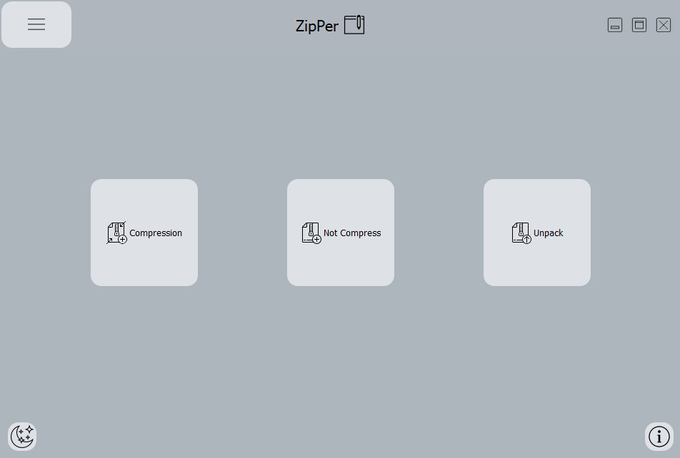
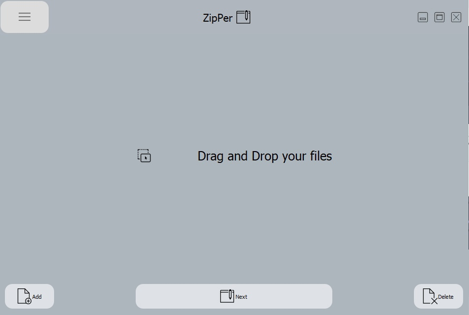
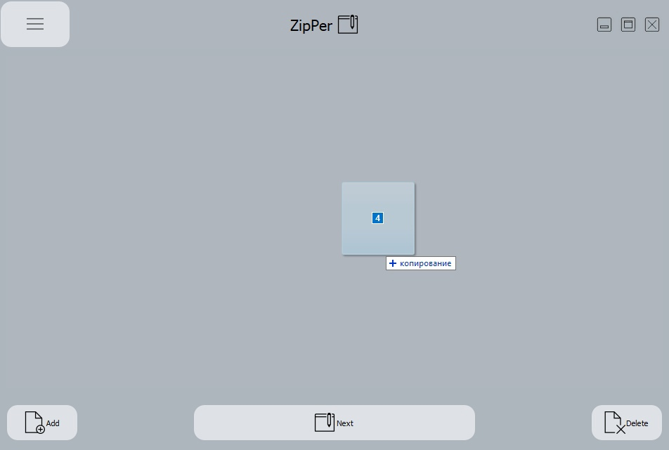
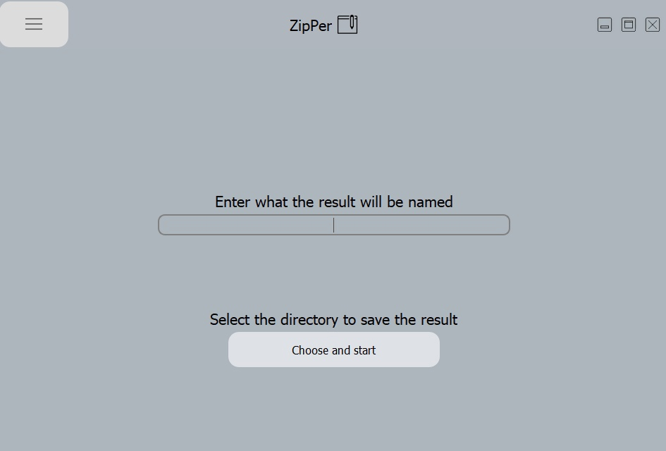
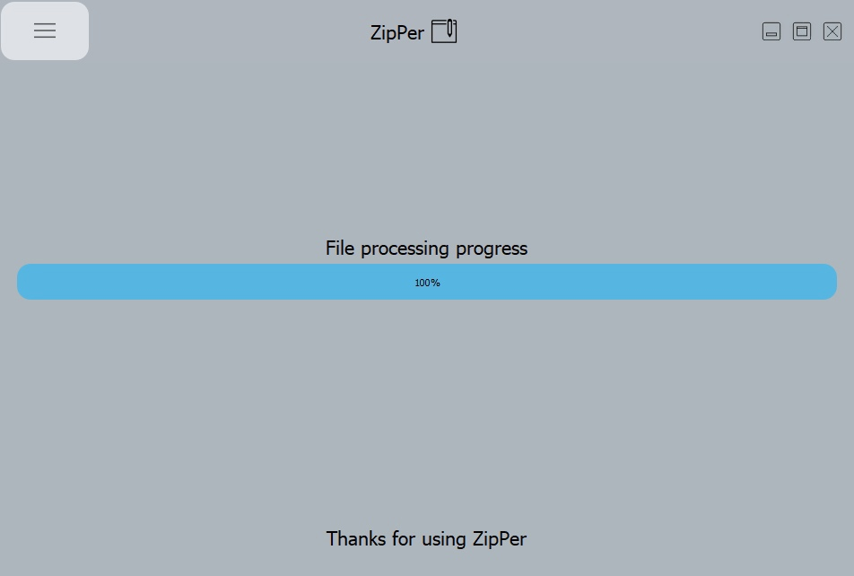
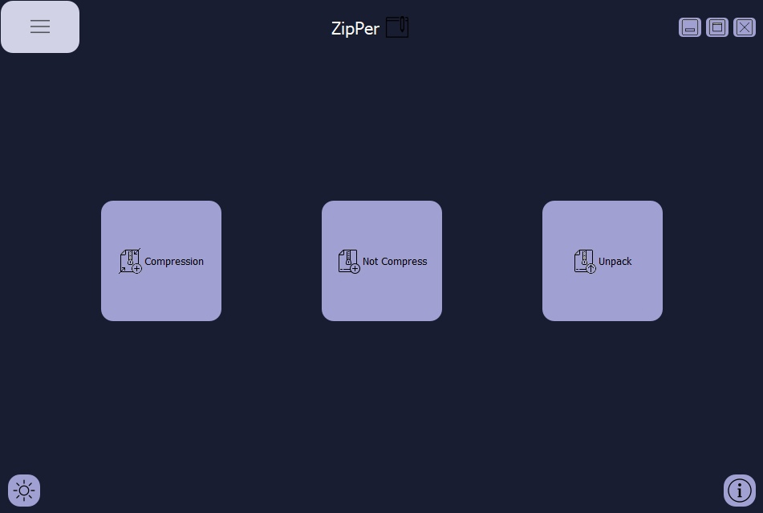

# ZipPer
Archive application
## What is it?
This application allows you to archive and unarchive files

## Download
If you just want to use the application, you can simply download the `ZipPerSetup.exe`, and install the application on your computer.  
Installer link [ZipPerSetup](https://github.com/twoics/ZipPer/blob/main/ZipPerSetup.exe)  

## Working with code
If you want to work with the current code you need to do a few things

1. Install Python version 3.6.0
2. Install the fbs and create a project, instructions on how to do this [Official fbs tutorial](https://github.com/mherrmann/fbs-tutorial)  

In short, you need to enter some commands in the console, in the project directory:  
```
pip install fbs-tutorial
```

```
fbs startproject
```

```
fbs run
```
3. You need to replace the folder `src/main` folder of your project to mine [My main folder](https://github.com/twoics/ZipPer/tree/main/src/main)  
> Done! Now you can work with the current project

## How to use it ?
After installation, open the application file, you will be greeted with the following window  
This is the main window of the application, here you can select the mode of operation that you want

- Create an archive using compression
- Create archive without compression
- Unarchive an archive

> 

After selecting the mode, you can add the files you want to work with, the application **supports drag and drop**, or you can add files manually. When you're done, click `next`
> Important note, if you have selected to `unzip`, you must add only `.ZIP` files, otherwise you will get a warning

> 
> 


After that, a window will open in which you will need to specify the **name** and the **directory** in which the **result** of the program will be **saved**
> 

If all the fields were filled out correctly, the progress of files processing will start, the progress will be displayed on the progress bar 
> When the program finishes, it will go to the main window by itself

> 

You can also change to a **dark theme** if you don't like the light theme. The **button** for this is on the main screen at the **bottom left**. 
Also, you can always get **information** on how to work with the application by clicking on the **button** in the main screen, **bottom right**
> 

## Resources
[fbs](https://github.com/mherrmann/fbs-tutorial)  
[Archive icon](https://icons8.com/icon/qSSG7p6hY0Gu/archive)  
[Create archive icon](https://icons8.com/icon/54616/create-archive)  
[Drag and drop icon](https://icons8.com/icon/JVl0bWweBNC4/drag-and-drop)  
[Moon icon](https://icons8.com/icon/KT7Ga62Q9nGj/moon)  
[Sun](https://icons8.com/icon/648/sun)  
[Zipper icon](https://icons8.com/icon/vbVVllhPCzuW/zipper)  
[Create icon](https://icons8.com/icon/qIZSSUb_zxBM/create)  
[Maximaze icon](https://icons8.com/icon/23536/maximize-window)  
[Minimaze icon](https://icons8.com/icon/23538/minimize-window)  
[Close icon](https://icons8.com/icon/22107/close-window)  
[Delete icon](https://icons8.com/icon/3555/delete-file)  
[Add icon](https://icons8.com/icon/11550/add-file)  
